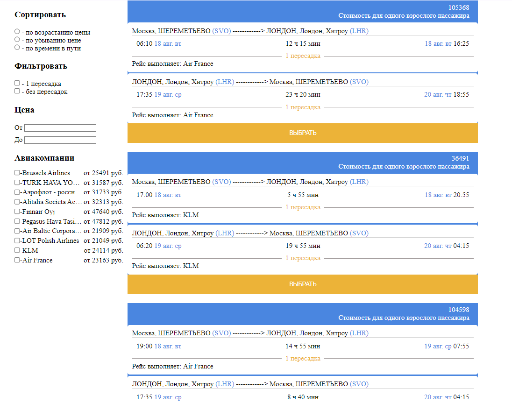

# Welcome to `Fights` pet project

Simple application represents `list` of plane tickets basen on data from JSON file 
and smart filters and sortings that could work all together. 

This project has been created using **webpack-cli**. All available 
scripts you can find at the bottom of this page.


### This project uses: 
* React 
* State managment - Redux | RTK 
* Typescript
* SASS 

### Gh-pages:

https://L1ghT0.github.io/Flights

#### The application consists of:
- Aside - settings panel used to contlrol the list
- List of plane tickets basen on data from JSON file

### Screenshots:



#### Available scripts:
```
npm run build
```

or

```
npm run build:prod
```

to bundle your application in production 

```
npm run build:dev
```

to bundle your application in development

```
npm run watch
```
turns on watch mode. This means that after the initial build, 
webpack will continue to watch for changes in any of the resolved 
files.

```
npm run serve
```

runs webpack-dev-server. 